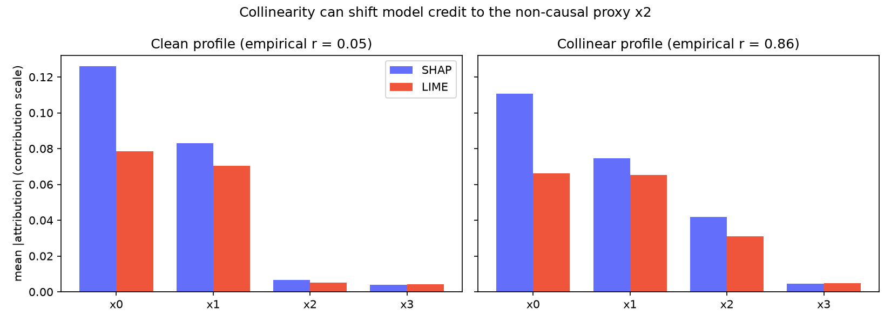

::: {.lead}
Type `shap.summary_plot(model, X)` and you get a beautiful, publication-ready
picture of "what your model thinks". It *feels* like understanding. It often
isn't. This guide shows you how to tell the difference — interactively.
:::

## The picture that feels like understanding

There is a moment every data scientist recognizes: you run
`shap.summary_plot(model, X)`, and out comes a clean, ranked list of features
with red and blue dots. The plot has axes, a color scale, and the quiet
authority of a peer-reviewed figure. "Now I understand my model," you think. The
internals that were opaque a minute ago suddenly have a story with heroes and
villains — *this* feature pushes the prediction up, *that* one drags it down.

The feeling is real, and it is almost never earned. A bar chart of attribution
values is a **description of a computation**, not evidence that the description
is correct. The plot can be beautiful, internally consistent, and faithful to
absolutely nothing. That gap — between "the explanation looks right" and "the
explanation *is* right" — is the whole subject of this article.

> **The question this article asks is not "how do I explain my model?", but
> "how do I know the explanation is *true*?"**

The reason this gap goes unchecked is structural. The tools we reach for — SHAP,
LIME, and the dozens of wrappers around them — are built to *produce*
explanations, and producing one is the end of their job. A library that hands
you a beautiful attribution plot has no incentive to ask whether that plot
tracks the model, survives a rerun, or holds up on a different slice of the
population. Checking is someone else's problem — which in practice means
nobody's. The tools that *check* explanations are rarer and far less polished,
because "can I trust this explanation?" is a much less marketable question than
"look, your model is now explained!"

## Four ways an explanation can lie

An explanation can look great and still be wrong in (at least) four independent
ways. You should hold every explanation up against all four.

### 1. It isn't faithful

Faithfulness is the first and most important property, and the one a pretty plot
hides most completely. An explanation is *faithful* when it tracks what the
model actually does: perturb the input, and the change the explanation predicts
should match the change the model produces [@yeh2019infidelity]. If the
explanation says feature `x2` is responsible for this prediction, then changing
`x2` — and nothing else — should move the prediction by an amount proportional
to its attribution. A SHAP plot never tells you whether this is true; it just
shows you numbers, and numbers always look confident.

Two cheap checks expose the gap:

- **Removal-effect correlation** — if a feature is ranked important, removing it
  should actually move the prediction.
- **Comprehensiveness** — removing the top-k features should move the prediction
  more than removing k random ones.

On the collinear dataset used throughout this article, the model's SHAP
explanations score a **removal-effect correlation of ≈ 0.59** and a
**comprehensiveness ratio of ≈ 4.7** — removing the top-3 features moves the
prediction roughly 4.7× more than removing 3 random features [@deyoung2020eraser].
Those are healthy numbers. They are also *earned*, not assumed: the same model
could just as easily have produced a gorgeous summary plot with a removal
correlation near zero, and the plot would look identical. "Good" here is not a
property of how the chart looks, but of how the explanation behaves under
ablation — and you have to measure that to know it.

### 2. The explainers disagree

SHAP and LIME are the two most widely used post-hoc explainers, and they do not
answer the same question. SHAP, in its modern form, is built on game-theoretic
Shapley values [@lundberg2017shap]; LIME fits a local linear surrogate around the
instance being explained [@ribeiro2016lime]. Both are reasonable, both are widely
trusted — and they frequently disagree, sometimes about the *direction* of a
feature's effect, sometimes only about its *rank*. When two reasonable methods
tell different stories about the *same prediction*, neither story deserves your
automatic trust [@krishna2024disagreement]. Disagreement is not proof that either
method is broken; it is proof that the attribution is *under-determined*, and
that the honest answer is "it depends" rather than a confident bar chart.

The punchline — and the part almost everyone gets wrong — is that **a big chunk
of the "disagreement" you read about is a category error**. Try the toggle
below: compare SHAP against LIME the *wrong* way, then the *right* way.

```{ojs}
// The centerpiece. data comes from article/scripts/generate_figures.py
data = FileAttachment("figures/conversion.json").json()
viewof use_contrib = Inputs.toggle({label: "Put LIME on the same scale as SHAP (contribution scale)", value: true})
lime = use_contrib ? data.contrib_lime : data.raw_lime
rank_corr = use_contrib ? data.after_rank_corr : data.before_rank_corr
```

```{ojs}
// Big number readout
display(htl.html`<div class="big-number">SHAP vs LIME rank correlation:
  <span class="${rank_corr > 0.4 ? 'good' : 'bad'}">${rank_corr.toFixed(2)}</span></div>
  <div style="color:#666">averaged over ${data.n_instances} instances · +1 = perfect agreement, 0 = none, −1 = opposite</div>`)
```

```{ojs}
// SHAP vs LIME scatter. Agreement = points on the diagonal.
scatter_data = data.features.map((f, i) => ({feature: f, shap: data.shap[i], lime: lime[i]}))
Plot.plot({
  height: 320,
  marks: [
    Plot.line([[-0.7, -0.7], [0.7, 0.7]], {stroke: "#ccc", strokeDasharray: "4 4"}),
    Plot.dot(scatter_data, {x: "shap", y: "lime", r: 6, fill: "#636EFA", tip: true})
  ],
  x: {label: "SHAP attribution"},
  y: {label: use_contrib ? "LIME attribution (contribution scale)" : "LIME attribution (raw weights)"},
  style: {fontSize: 12}
})
```

Two independent mistakes turn this real-but-manageable disagreement into the
"SHAP and LIME completely disagree!" number you see in blog posts. The first is
**output space**. For a classifier, SHAP values are expressed in *log-odds* of
the predicted class, while LIME's raw weights are fit in *probability* space.
Comparing a log-odds number to a probability number is like comparing Celsius to
Fahrenheit without converting — of course the two series look uncorrelated; they
live on different scales.

The second mistake is subtler and matters more. SHAP values are
**contributions**: they satisfy `Σ φ_i ≈ f(x) − E[f(x)]`, a statement about how
far this prediction sits from the baseline. LIME weights are **slopes**: they
satisfy `f(x̃) ≈ f(x) + φ·(x̃ − x)`, a statement about the local rate of change.
A slope and a contribution are different quantities with different units, and
feeding one into a metric designed for the other is a category error
[@yeh2019infidelity]. Fixing both — pinning everything to log-odds, and rescaling
LIME's slopes onto SHAP's contribution scale — is what the toggle above does. In
this dataset the apparent SHAP–LIME rank correlation flips from **−0.10 to
+0.66**, and the sign-disagreement rate drops from 0.55 to 0.28, the moment you
compare like with like.

::: {.quote}
Most "SHAP and LIME completely disagree" blog posts are measuring a category
error. The real, remaining disagreement is smaller — and that's the part worth
investigating.
:::

### 3. It doesn't reproduce

Take the same instance and the same trained model, and explain it twice with a
different random seed. If the two explanations differ, the explanation is not a
fact about your model — it is partly an artifact of the explainer's internal
coin flips. Stochastic methods such as KernelSHAP and LIME sample perturbations
to approximate their answer, so they *will* vary from run to run; the only
question is how much. We measure this with run-to-run **rank correlation**,
**sign agreement**, and **top-k overlap**. On the dataset used here, LIME's
run-to-run rank correlation is ≈ 0.82 and its top-3 sign agreement is 1.0 —
reproducible enough to act on, but only because we checked.

TreeSHAP, by contrast, is deterministic and therefore trivially stable. Watch
the trap here: *determinism is not correctness*. A wrong answer that never
changes is stable, not trustworthy. Stability is necessary; it is never
sufficient.

### 4. It doesn't generalize across the distribution

A single explanation is a point estimate, and a point estimate can be locally
true and globally false. The question the previous three checks do not answer is
whether the *story* — the ranking of important features — holds across
subpopulations and under distribution shift. This is the least-known check and
the one almost no tool offers: split your data into segments (by a demographic,
by a cluster, by time), recompute global feature importance within each, and ask
whether the ranking stays stable. We report **cross-segment rank stability**
(the correlation of importance rankings between segments) and the **top-k flip
rate** (how often a segment's top features differ from the reference). If the
story flips between segments, the explanation is an artifact of one slice, not a
property of the model — and it should not travel with the model into deployment.

## A worked example: collinearity quietly lies to you

To make these failures concrete, here is a deliberately small experiment with a
known ground truth. We generate data where two features, `x0` and `x1`, actually
drive the label, and where a third feature `x2` is *collinear with* `x0` — it is
a near-copy of a real cause, but causally inert. The remaining features are pure
noise. This is the setup where explanations misbehave in the wild: the model can
afford to ignore `x2` entirely and still predict well, but the data gives an
explainer every reason to confuse `x2` for `x0`.



The two panels show the same analysis at two levels of collinearity. On the left
(correlation `ρ ≈ 0`), both SHAP and LIME correctly treat `x2` as unimportant —
as they should, since it is causally inert. On the right (`ρ ≈ 0.85`), the story
changes: LIME starts crediting `x2` as if it were a real driver, in some cases
nearly as much as `x0` itself. SHAP resists a little better, but both are now
telling a story that is partly false.

Why does this happen? When `x2` is nearly indistinguishable from `x0`, the
*prediction* barely changes whether the model uses one or the other — so the
attribution is **under-determined**. There is no single correct answer to "how
much did `x0` contribute?", because the data cannot separate `x0`'s contribution
from `x2`'s. Any reasonable method must break the tie arbitrarily, and different
methods break it differently. Notice what this means for the trust battery: the
model is fine — its predictions are just as good — but the *explanation* has
quietly started teaching you a false causal story, and neither eyeballing the
plot nor admiring its colors would stop you.

## So what should you do instead?

A trust battery — run these before you trust any post-hoc explanation:

| Check | Metric | Good sign |
|---|---|---|
| Faithful? | removal-effect correlation, comprehensiveness | corr high; ratio ≫ 1 |
| Reproducible? | run-to-run rank/sign/top-k stability | corr ≈ 1 |
| Internally consistent? | SHAP vs LIME agreement (same scale) | rank corr high |
| Generalizes? | cross-segment stability, top-k flip rate | stable, low flip |

The checklist has one principle behind it: **measure, don't eyeball.** Stop
asking whether an explanation *looks* right and start asking whether it survives
a set of simple, reproducible perturbations. Just as important, keep the two
stages separate: the metrics *measure* (a correlation, a flip rate), and only
you can *interpret* (does a rank correlation of 0.6 matter for your use case,
with your model, for your audience?). The thresholds in any library — including
the one below — are sensible starting points, not laws of nature. Calibrate them
against what you care about, and treat a passing score as permission to look
closer, never as a certificate.

The library that produced every number in this article is open source:
[**explaintrust**](https://github.com/lvcheer/explaintrust) — a small,
opinionated Python package that runs this battery for you.

## Caveats

A few honest caveats. explaintrust is at v0.1 and covers **tabular data with
SHAP and LIME only** — image, text, LLM interpretability, and counterfactual
explanations are out of scope for now. The report thresholds are *sensible
defaults, not calibrated claims*; they are labeled as such and meant to be
overridden with domain knowledge. And the deepest caveat of all: these metrics
are **necessary but not sufficient**. No single number — and no battery of
numbers — certifies an explanation. Explainability is not a badge you print; it
is a property of the model, the data, and the audience together. The best these
checks can do is turn "I trust this because it looks nice" into "I trust this
because I tested it" — and that, it turns out, is most of the way there.

## References {.unnumbered}

::: {#refs}
:::
